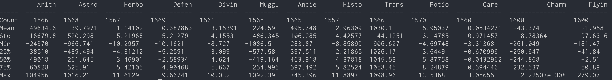

# DSLR


## Data Analysis
The following commands can be used to obtain statistical information about the data.

```bash
python describe.py dataset/dataset_train.csv
```



<br></br>

## Data Visualization
### Histogram

```bash
python histogram.py dataset/dataset_train.csv
```
