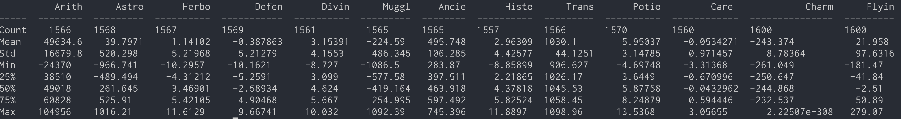
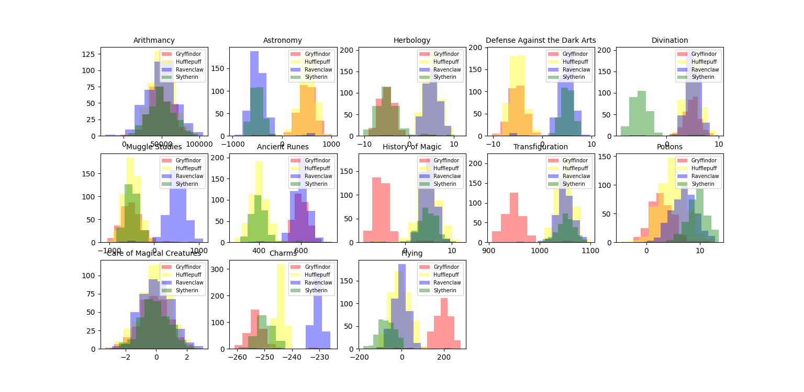
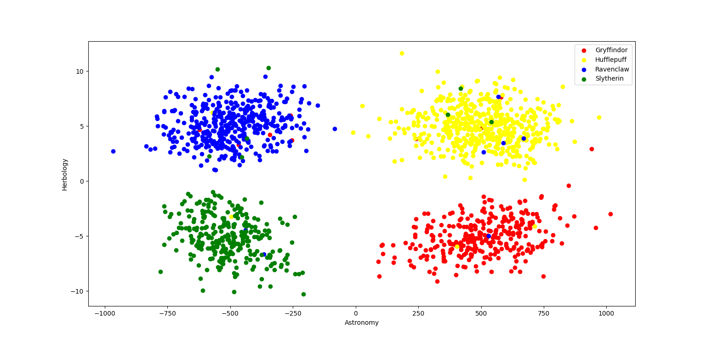
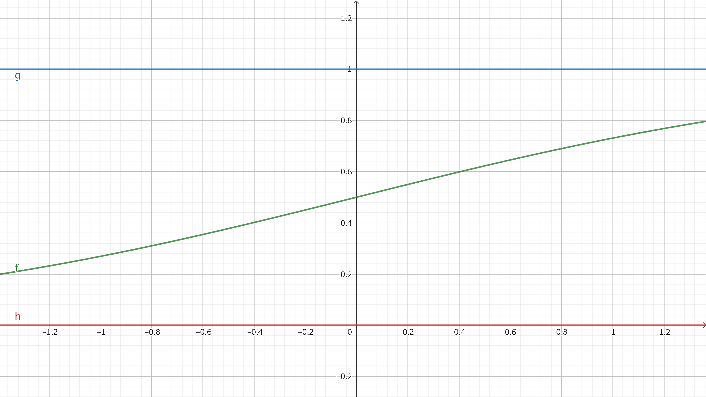
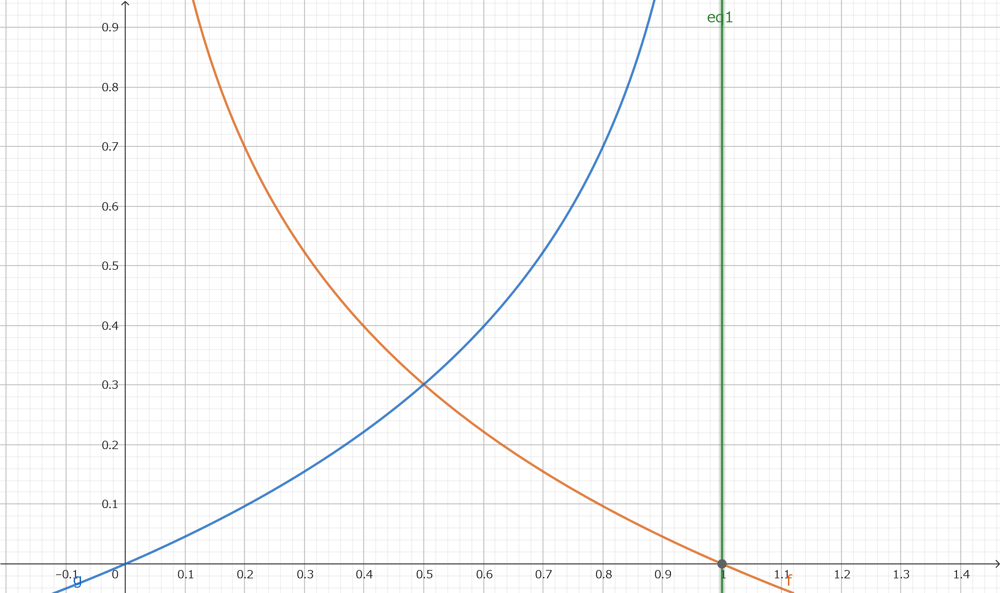

# DSLR
In this project DataScience x Logistic Regression, I will continue my exploration of Machine Learning by discovering different tools.

<br></br>

## Introduction

```
On no! Since its creation, the famous school of wizards, Hogwarts, had never known such an offense. The forces of evil have bewitched the Sorting Hat. It no longer responds, and is unable to fulfill his role of sorting the students to the houses.
The new academic year is approaching. Gladly, the Professor McGonagall was able to take action in such a stressful situation, since it is impossible for Hogwarts not to welcome new students. . . She decided to call on you, a muggle "datascientist" who is able to create miracles with the tool which all muggles know how to use: a "computer".
Despite the intrinsic reluctance of many wizards, the director of the school welcomes you to his office to explain the situation. You are here because his informant discovered that you are able to recreate a magic Sorting Hat using your muggle tools. You explain to him that in order for your "muggle" tools to work, you need students data. Hesitantly, Professor McGonagall gives you a dusty spellbook. Fortunately for you, a simple "Digitalis!" and the book turned into a USB stick.
```

<br></br>

## Data Analysis
First of all, take a look at the available data. look in what format it is presented, if there are various types of data, the different ranges, and so on. It is important to make an idea of your raw material before starting. The more you work on data - the more you develop an intuition about how you will be able to use it.

The following commands can be used to obtain statistical information about the data.

```bash
python describe.py dataset/dataset_train.csv
```



<br></br>

## Data Visualization
Data visualization is a powerful tool for a data scientist. It allows you to make insights and develop an intuition of what your data looks like. Visualizing your data also allows you to detect defects or anomalies.

### Histogram
`
Which Hogwarts course has a homogeneous score distribution between all four houses?
`


The following commands can be used to obtain a histogram about the data.

```bash
python histogram.py dataset/dataset_train.csv
```



### Scatter plot
`What are the two features that are similar ?`

The following commands can be used to obtain a scatter plot about the data.

```bash
python scatter_plot.py --data_file_path dataset/dataset_train.csv --x_item Astronomy --y_item Herbology
```



### Pair plot
`From this visualization, what features are you going to use for your logistic regression?`

The following commands can be used to obtain a pair plot about the data.

```bash
python pair_plot.py dataset/dataset_train.csv
```


<br></br>

## Logistic Regression
`You arrive at the last part: code your Magic Hat. To do this, you have to perform a multi-classifier using a logistic regression one-vs-all.`

We utilize the sigmoid function to map input values from a wide range into a limited interval. Mathematically, the sigmoid function is:

$$
y=g(z)=\frac{1}{1+e^{-z}}
$$



This formula represents the probability of observing the output y = 1 of a Bernoulli random variable.
It squeezes any real number to the (0,1) open interval. Thus, it’s better suited for classification. Moreover, it’s less sensitive to outliers, unlike linear regression:

More formally, we define the logistic regression model for binary classification problems. We choose the hypothesis function to be the sigmoid function:

$$
h_\theta(x)=\frac{1}{1+e^{-\theta^Tx}}
$$

### Cost function
In linear regression, we use mean squared error (MSE) as the cost function. But in logistic regression, using the mean of the squared differences between actual and predicted outcomes as the cost function might give a wavy, non-convex solution; containing many local optima:

In this case, finding an optimal solution with the gradient descent method is not possible. Instead, we use a logarithmic function to represent the cost of logistic regression. It is guaranteed to be convex for all input values, containing only one minimum, allowing us to run the gradient descent algorithm.

When dealing with a binary classification problem, the logarithmic cost of error depends on the value of y. We can define the cost for two cases separately:

$$
cost(h_\theta(x),y)=\begin{cases}-log(h_\theta(x)) & (y=1) \\ -log(1-h_\theta(x)) & (y=0) \end{cases}
$$



For m observations, we can calculate the cost as:

$$
J(\theta)=-\frac{1}{m}\sum_{i=1}^{m}y_i log(h_\theta(x_i))+(1-y_i)log(1-h_\theta(x_i))
$$

### Minimize the cost with gradient descent
Assume we have a total of n features. In this case, we have n parameters for the $\theta$ vector. To minimize our cost function, we need to run the gradient descent on each parameter $\theta_j$:

$$
\theta_j \leftarrow \theta_j-\alpha\frac{\partial}{\partial\theta_j}J(\theta)
$$

The derivative of the cost function is as follows.

$$
\frac{\partial}{\partial\theta_j}J(\theta)=\frac{1}{m}\sum_{i=1}^{m}(h_\theta(x^{(i)})-y^{(i)})x_j^{(i)}
$$

Update the parameters using the learning rate $\alpha$.

$$
\theta_j \leftarrow \theta_j-\alpha\frac{1}{m}\sum_{i=1}^{m}(h_\theta(x^{(i)})-y^{(i)})x_j^{(i)}
$$

After updating the parameters, the cost function is calculated again, and if it is lower than the threshold, it is taken as the final result; otherwise, the parameters are updated again. In this case, 0.1 is used for the learning rate.

### Training
Create a logistic regression model for the four houses. Each model should be trained to output 1 for the target house and 0 for the other houses.
To stabilize the learning, [scaling to a range](https://developers.google.com/machine-learning/data-prep/transform/normalization) is used as normalization.

The following commands can be used to train a model about the data by using logistic regression.

```bash
python logreg_train.py --train_data_path dataset/dataset_train.csv --output_param_path param/param.yaml
```

### Prediction
The outputs of the sigmoid functions of the four models are compared and the house with the largest output value is output as the result. The result for the test data(dataset/dataset_test.csv) was **99.0%**.

The following commands can be used to predict a house about the test data.

```bash
python logreg_predict.py --test_data_path dataset/dataset_test.csv --truth_data_path dataset/dataset_truth.csv --param_path param/param.yaml
```

<br></br>

## References
- [Conceptual Understanding of Logistic Regression for Data Science Beginners](https://www.analyticsvidhya.com/blog/2021/08/conceptual-understanding-of-logistic-regression-for-data-science-beginners/)
- [Gradient Descent Equation in Logistic Regression](https://www.baeldung.com/cs/gradient-descent-logistic-regression)
- [Logistic regression](https://bellcurve.jp/statistics/course/26934.html#:~:text=%E3%83%AD%E3%82%B8%E3%82%B9%E3%83%86%E3%82%A3%E3%83%83%E3%82%AF%E5%9B%9E%E5%B8%B0%E5%88%86%E6%9E%90%E3%81%AF%E3%80%81%E7%9B%AE%E7%9A%84,%E3%81%99%E3%82%8B%E3%81%93%E3%81%A8%E3%81%8C%E3%81%A7%E3%81%8D%E3%81%BE%E3%81%99%E3%80%82)
